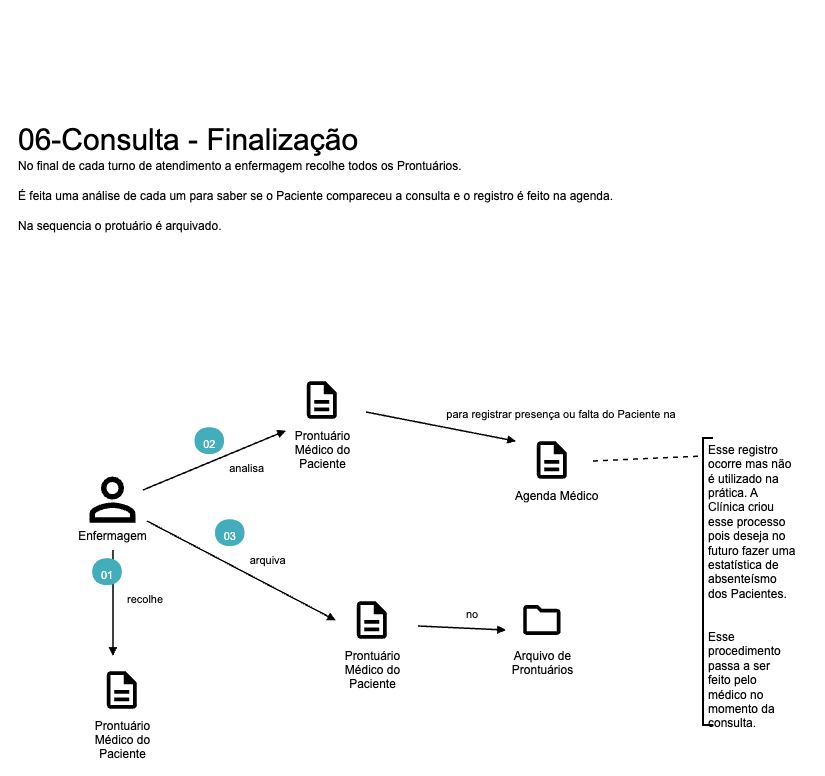

# Clínica Alo Doutor

## Histórico da Clínica

A clímica Alô Doutor provê um serviço gratuito de consultas médicas para a população utilizando o sistema de atendimento presencial. 

A  clínica foi fundada em 2010 e desde então vem atendendo a população de forma gratuita. A clínica conta com médicos voluntários que atendem a população de segunda a sexta das 9h às 17h. 

Para se voluntariar, o médico precisa ter disponibilidade de trabalhar pelo menos um mês de segunda a sexta em um turno específico (manhã ou tarde).

Atualmente todo o trabalho da clínica é feito de forma manual em fichas de papel, porém a clínica está buscando modernizar o seu sistema de atendimento para melhorar a experiência do paciente e do médico.

Nesse momento foi solicitado que a informatização fosse realizada sem melhorias no processo atual. 

### DDD

#### Domain Storytelling

O time de desenvolvimento conversou com o responsável pela clínica, uma pessoa do RH, um médico e uma recepcionista e identificou os seguintes pontos:

#### Domínios e Contextos Delimitados Identificados

TODO - Incluir imagem com os contextos delimitados

#### Relacionamento entre Contextos Delimitados

TODO - Incluir imagem com os relacionamentos entre os contextos delimitados

### Critérios de Aceite

- Cadastro de Médico 
    - O médico não pode ser cadastrado sem nome, CRM, especialidade e turno de atendimento
    - Não pode haver dois médicos com o mesmo CRM
    - O proprio medico pode se cadastrar porém o RH precisa validar o seu registro
    - O médico só pode alterar o seu horário de atentimento do dia 01 ao dia 15 e a alteração só é válida para a agenda do mês seguinte
    - O próprio médico pode se tornar indisponível para atendimento. Essa alteração só pode ser feita de 01 a 15 do mês e só é válida para a agenda do mês seguinte

 

- Cadastro do Paciente
    - O Paciente não pode ser cadastrado sem nome, CPF, data de nascimento e telefone
    - Não pode haver dois pacientes com o mesmo CPF
    - O próprio paciente pode se cadastrar no sistema porém algum recepcionista precisa validar o cadastro
    
 

- Geração da Agenda
    - A agenda só pode ser gerada para o mês seguinte a partir do dia 15 do mês atual
    - A agenda só pode ser gerada para o mês seguinte para médicos ativos
    - As consultas tem 30min de duração

 

- Marcação de Consultas
    - O Paciente pode marcar consulta desde que existam horários livres para o médico desejado
    - O Paciente não pode marcar duas consultas no mesmo dia e horário
    - A consulta pode ser cancelada pela Secretária ou pelo Paciente
    - A secretária também pode marcar consultas para os Pacientes

 

- Controle de Acesso
    - A administração da Clínica quer que o sistema tenha controle de acesso para os usuários com os seguintes perfis:
        - Médico
            - Só pode se cadastrar e alterar seus horários de atendimento
        - Secretária
            - Pode marcar e cancelar consultas
            - Pode gerar a agenda
            - Aprova cadastro de Pacientes
        - RH
            - Aprova cadastro de Médicos            
        - Paciente
            - Pode marcar e cancelar consultas
            - Pode se cadastrar no sistema
        - Enfermagem
            - Lista as consultas de um dia e turno específico
            - Registra comparecimento ou falta do paciente
        - Administração
            - Tem permissão total no sistema

